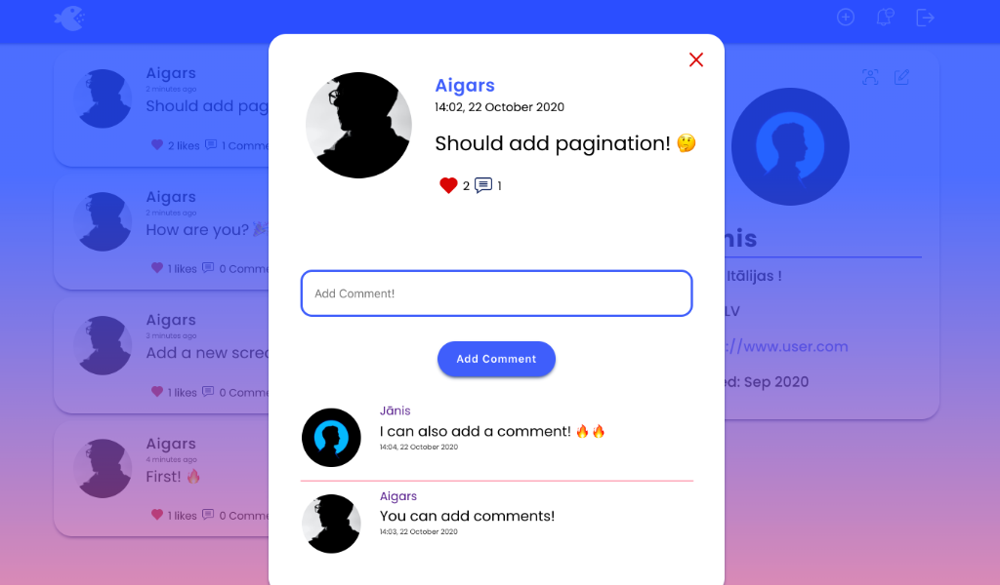
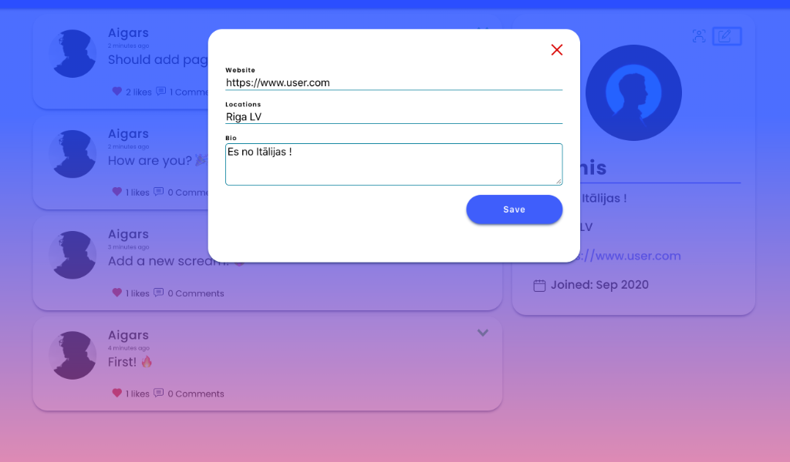
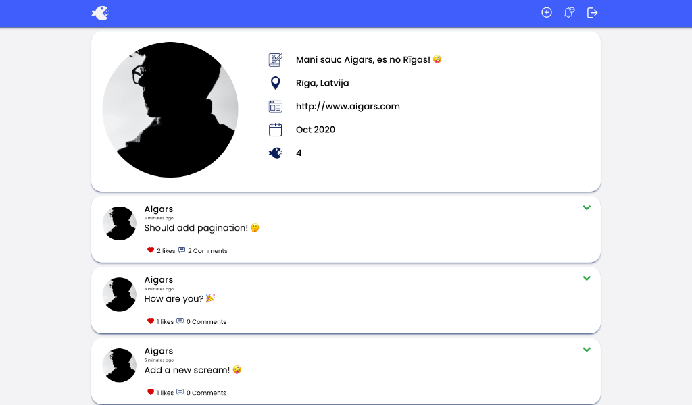
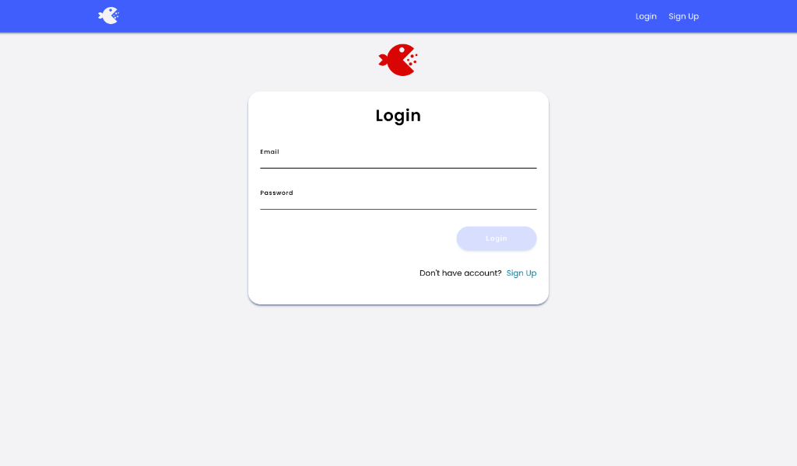
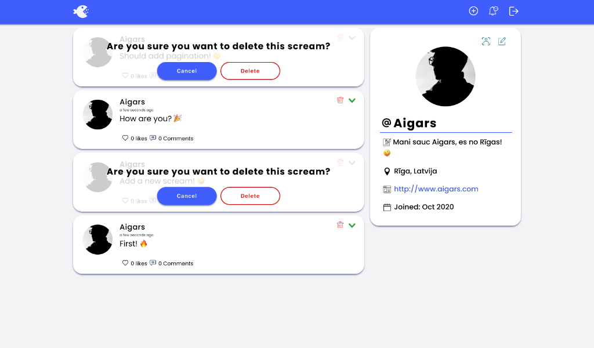
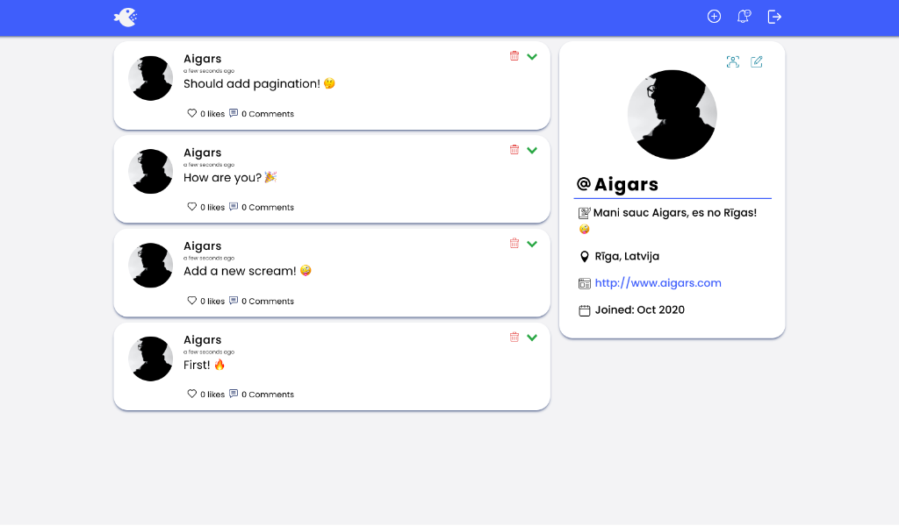
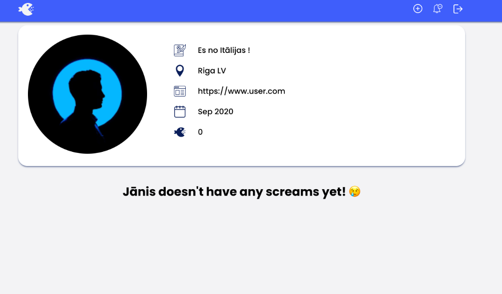
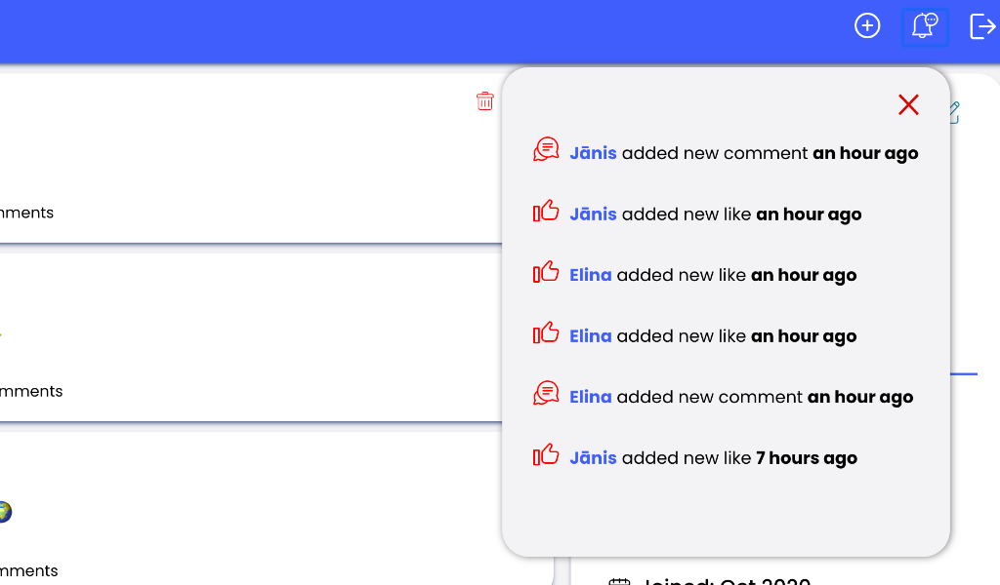

# SOCIAL-MEDIA-APP

## Available Scripts

### Install dependencies

```bash
npm install
```

### Run App

```bash
npm run start
```

Runs the app in the development mode.<br />
Open [http://localhost:5000/](http://localhost:5000/) to view it in the browser.

The page will reload if you make edits.<br />
You will also see any lint errors in the console.

### Build for production

```bash
npm run build
```

## Screenshots

<p align="center">
  
</p>









